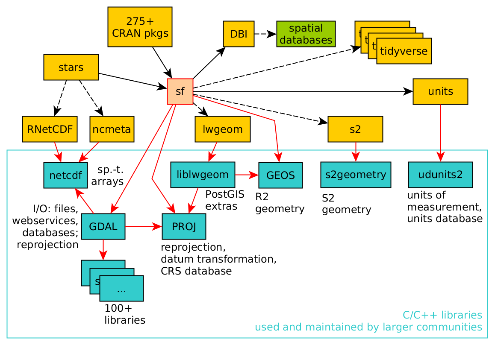
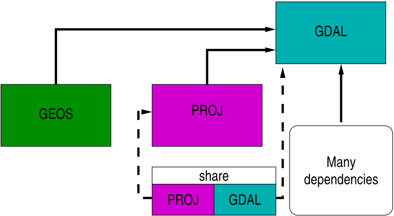
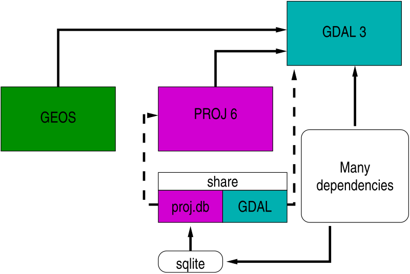
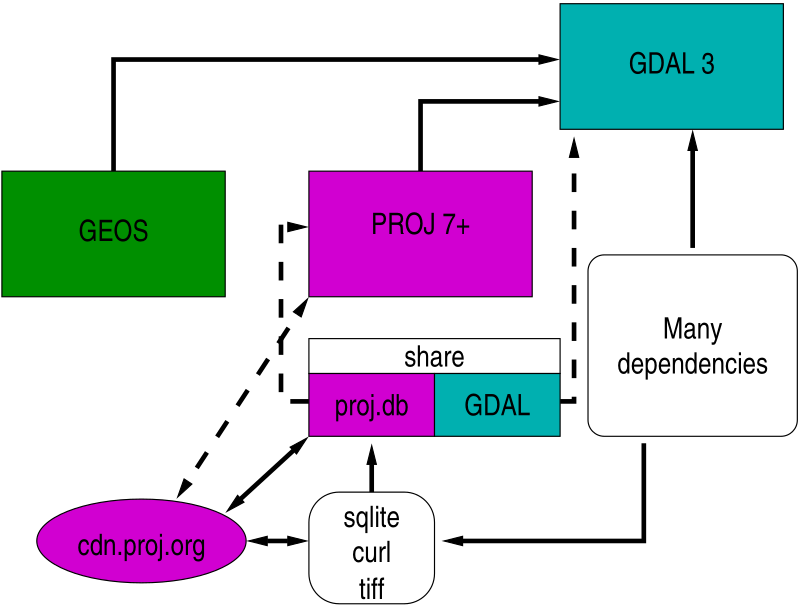
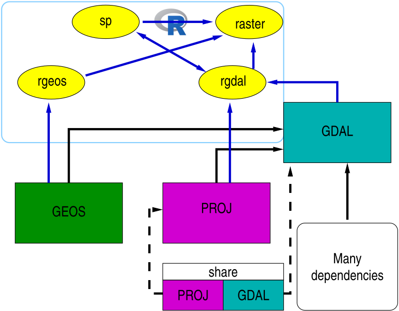
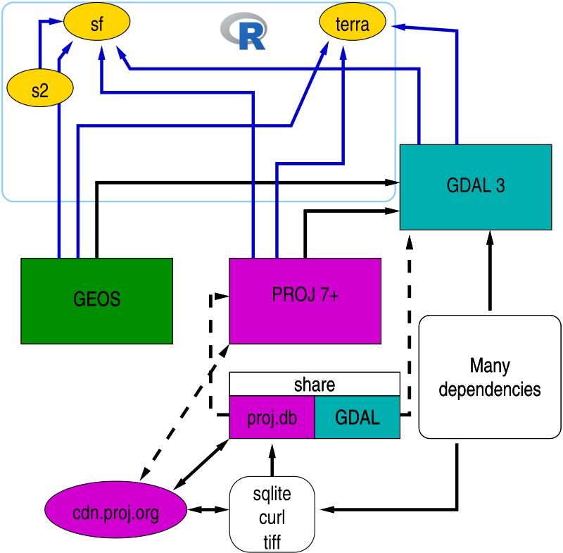

```{r setup, include=FALSE}
knitr::opts_chunk$set(echo = FALSE)
.libPaths(c(.libPaths()[1], paste(.libPaths()[1], "_retiring", sep="")))
```

```{r, echo=FALSE, eval=FALSE}
echo=FALSE,eval=FALSE>>= 
BCrepos <- BiocManager::repositories()
bioc <- available.packages(repo = BCrepos[1])
bioc_ann <- available.packages(repo = BCrepos[2])
bioc_exp <- available.packages(repo = BCrepos[3])
cran <- available.packages()
saveRDS(cran, file="cran_221222.rds")
pdb <- rbind(cran, bioc, bioc_ann, bioc_exp)
saveRDS(pdb, file="pdb_221222.rds")
pdb <- readRDS("pdb_221222.rds")
suppressPackageStartupMessages(library(miniCRAN))
suppressPackageStartupMessages(library(igraph))
suppressPackageStartupMessages(library(magrittr))
pg <- makeDepGraph(pdb[, "Package"], availPkgs = pdb, suggests=TRUE, enhances=TRUE, includeBasePkgs = FALSE)
pr <- pg %>%
  page.rank(directed = FALSE) %>%
  use_series("vector") %>%
  sort(decreasing = TRUE) %>%
  as.matrix %>%
  set_colnames("page.rank")
cutoff <- quantile(pr[, "page.rank"], probs = 0.1)
popular <- pr[pr[, "page.rank"] >= cutoff, ]
toKeep <- names(popular)
vids <- V(pg)[toKeep]
gs <- induced.subgraph(pg, vids = toKeep)
cl <- walktrap.community(gs, steps = 3)
topClusters <- table(cl$membership) %>%
  sort(decreasing = TRUE) %>%
  head(25)
cluster <- function(i, clusters, pagerank, n=10){
  group <- clusters$names[clusters$membership == i]
  pagerank[group, ] %>% sort(decreasing = TRUE) %>% head(n)
}
z <- lapply(names(topClusters)[1:15], cluster, clusters=cl, pagerank=pr, n=50)
saveRDS(z, file="all_z_221222.rds")
```


## Summary

- Packages **rgdal**, **rgeos** and **maptools** will retire (be archived on CRAN) during 2023, planned during October 2023

- One reason is to reduce exposure to maintenance failure (the maintainer is not getting younger); another that available developer effort is best devoted to available, more modern packages such as **sf**, **terra**, **stars** and others

- Work is under way to replace some of the use of **rgdal** and **rgeos** in **sp** by calls to **sf**, so **sp** workflows should continue to function after adaptation

- The maintainer of **raster**, Robert Hijmans, has already replaced calls to **rgdal** and **rgeos** in **raster** by calls to **terra**

## Background

- The R.\*spatial package ecosystem is evolving: what are the main drivers? R.\*spatial includes [R-spatial](https://r-spatial.org) and [Rspatial](https://rspatial.org), and their Github organisations [R-spatial](https://github.com/r-spatial) and [Rspatial](https://github.com/rspatial)

- One driver has been the widespread adoption of the **Rcpp** package for interfacing C++ libraries in R packages [@eddelbuettel2013seamless]
 
- Another has been the rapid pace of change in OSGeo FOSS libraries over the last few years

- Finally, since at least 2016, Edzer Pebesma and I have been aware that the user base should be protected from maintenance failure for key infrastructure packages, those we intend to retire and archive during 2023: **rgdal**, **rgeos** and **maptools**
 
# The evolving R.*spatial package ecosystem

## The evolving R.*spatial package ecosystem

- In the first edition of @asdar1, 12 R packages depended directly (strongly) on **sp**, a package providing classes and methods for spatial objects

- By the second edition five years later, the `"strong"` dependency count was 78, but the count of recursive `"most"` dependencies (Depends, Imports, LinkingTo, Suggests) was 507

- Today, recursive reverse `"most"` dependencies total 16692 of 18947 CRAN packages; it is more important to tally non-recursive reverse dependencies, `"most"`: 610 and `"strong"`: 486

- The new **sf** package shows non-recursive reverse dependency counts: `"most"`: 539 and `"strong"`: 395


## R.*spatial package cluster pagerank scores

```{r, echo=FALSE, fig.height=6, fig.width=12, out.width="100%"}
suppressPackageStartupMessages(library(wordcloud))
z <- readRDS("all_z_221222.rds")
pr <- readRDS("pr_221222.rds")
oopar <- par(mfrow=c(1,2))
par(mar=c(0,0,0,0)+0.1)
sc <- c(4, 0.4)
is_sp <- which(sapply(z, function(x) "sp" %in% names(x)))
z2 <- sort(c(sf=pr["sf",], terra=pr["terra",], z[[is_sp]]), decreasing=TRUE)
wordcloud(names(z2), freq=unname(z2), scale=sc) 
par(mar=c(5,6,4,2)+0.1, las=1)
cols <- rep("gray90", 19)
cols[c(4,6,7)] <- "gray60"
barplot(z2[1:19], horiz=TRUE, xlab="pagerank", col=cols)
par(oopar)
```


## Starting **sf** - Simple Features

- At useR! in 2016, list columns were declared "tidy", using examples including the difficulty of encoding polygon interior rings in non-list columns (https://www.r-consortium.org/all-projects/awarded-projects/2016-group-1#simple+features+for+r)

- The decision to accommodate "tidy" workflows as well as base-R workflows had already been made, as at least some users only know how to use "tidy"  workflows

- @sf-rj shows the status of the **sf** towards the end of 2017, with a geometry list column containing R wrappers around objects adhering to Simple Features specification definitions

- The feature geometries are stored in numeric vectors, matrices, or lists of matrices, and may also be subject to arithmetic operations

## Why Simple Features?

- The `"ESRI Shapefile"` format was created before the OGC standard ISO 19125-1:2004 [@sfa], so polygon geometries are not stored as Simple Features exterior and interior rings, with exterior-interior only marked by ring direction without assignment of interior to exterior rings; **sp** initially followed this representation

- GDAL and GEOS use Simple Features internally, so the `"ESRI Shapefile"` model of polygons used in **sp** ceased to be a good fit to libraries used for reading, writing, and manipulating geometries; interior ring membership of external rings was encoded in an string comment added to geometries, not a robust representation

## **sf** a moving target

- @units discussed the need to add proper handling of metric units for data and position before **sf** appeared (https://cran.r-project.org/package=units); the same applies to the desirability of meaningful aggregation attributes to data (@STASCH2014149, @scheider2016)

- So **sf** (https://cran.r-project.org/package=sf) is also a platform for community development of a range of ideas 

- One such idea is to distinguish between planar and spherical (ellipsoidal) representations, so using GEOS for topological predicates and operations on planar geometries, and **s2** for spherical geometries, see (https://github.com/geopandas/community/issues/10, https://r-spatial.org/book/04-Spherical.html, https://www.r-consortium.org/all-projects/awarded-projects/2019-group-1#r-global:+analysing+spatial+data+globally)

## **sf** a moving target

- Another is to explore not treating points as features (https://github.com/r-spatial/sf/pull/2059) as iterating over features can be costly

- **sf** also provides **stars** with functionality in external libraries (https://cran.r-project.org/package=stars, https://www.r-consortium.org/all-projects/awarded-projects/2017-group-1#stars:+scalable,+spatiotemporal+tidy+arrays+for+r)

- **sfnetworks** (https://cran.r-project.org/package=sfnetworks, https://www.r-consortium.org/all-projects/awarded-projects/2019-group-2#tidy+spatial+networks+in+r)

## **sf** a moving target

- **sftime** (https://cran.r-project.org/package=sftime, https://www.r-consortium.org/all-projects/awarded-projects/2020-group-1#spatiotemporal+data+and+analytics)

- **sftrack** (https://cran.r-project.org/package=sftrack, https://www.r-consortium.org/all-projects/awarded-projects/2019-group-1#sftraj:+a+central+class+for+tracking+and+movement+data, https://www.r-consortium.org/all-projects/awarded-projects/2020-group-1#sftrack+v1.0:+stable+api+for+a+broad+adoption)

- **cubble** (https://cran.r-project.org/package=cubble)

## **Rcpp**

- While initially only GDAL used a C++ API, and GEOS and PR$\phi$J C APIs, now only GEOS prefers a C API (it is modern C++ internally, but presents a C API)

- During the barn-raising, PR$\phi$J was more tightly integrated with GDAL, and both adopted more modern C++ interfaces

- This means that **Rcpp** is a much better fit to these libraries, and that code in **rgdal** and **rgeos** interfacing them will become increasingly hard to maintain

- **terra** has also been written to interface these libraries using **Rcpp**; of course **rgeoda** uses **Rcpp**

## OSGeo FOSS libraries and **sf**

```{r, echo=FALSE, out.width="80%"}

```

## CRAN binaries are statically linked

- CRAN packages are provided as source packages, and in addition as pre-installed binary packages for 64-bit Windows, and 64-bit macOS for Intel and ARM architectures

- These binary packages are statically linked, as dynamic linking to upstream libraries built using other tool sets is a prime potential source of inexplicable software failures

- This means that external libraries (and libraries they may depend on) must also be built and updated (and they have all shifted to `cmake`)

- Changing to UCRT on Windows with Rtools42 has permitted more driver variants to be added (https://svn.r-project.org/R-dev-web/trunk/WindowsBuilds/winutf8/ucrt3/toolchain_libs/mxe/src/gdal.mk); macOS (https://github.com/R-macos/recipes/blob/master/recipes/gdal) is a bit behind

- No CONDA here!

# When upstream OSGeo FOSS libraries change

## Upstream OSGeo libraries

- PR$\phi$J is really important, and has been used to define coordinate reference systems and carry out coordinate operations (projection since the 1970s, transformation for about twenty years)

- GEOS was first interfaced to R package in a package by Colin Rundell in a GSoC project in 2010, and its use has increased since then

- GDAL bindings were first created as an R package twenty years ago, initially just for raster data, but quickly extended to vector data

- R packages for spatial data have been updated as PR$\phi$J, GEOS and GDAL have evolved, quite fast since the GDAL barn-raising occurred

- Following the development email lists: `proj`, `geos-devel`, `gdal-dev` has been crucial

## OSGeo FOSS foundations

- R is FOSS itself through contributed packages that the user may choose to install in R libraries

- The shared FOSS foundations are PR$\phi$J, GEOS and GDAL

- PR$\phi$J (then often called Proj4) provides coordinate reference systems (CRS) definitions, and projection and datum transformation operations

- GEOS provides planar topological predicates and operations

- GDAL provides abstractions for reading, writing, manipulating and transforming GIS data using drivers for raster and vector data

## OSGeo FOSS foundations

```{r, echo=FALSE, out.width="80%"}

```

## Pre barn-raising status

- PR$\phi$J < 6 and GDAL < 3 used to ship with shared flat text files providing metadata about coordinate reference systems. Pre-PR$\phi$J 6, PR$\phi$J 5 introduced pipelines for projection and datum transformation operations [@knudsen+evers17, @evers+knudsen17]

- PROJ 4 had been stuck with an outdated WGS84 (World Geodetic System 1984 and `+towgs84=` key-value pairs) datum transformation hub introducing errors of up to 2m

- All datum transformations were forced through WGS84 as an intermediate product.

## Barn-raising 

- Following the Barn Raising project (https://gdalbarn.com/), PR$\phi$J 6 and GDAL 3 were released together, with GDAL 3 requiring PR$\phi$J >= 6

- The most obvious changes were that PR$\phi$J now stored CRS, projection and transformation metadata in an SQLite database, also used by GDAL, and that most of the legacy flat text files were replaced by database tables

- The database file made it much easier to adopt OGC WKT2 (2019) for specifying CRS

- This provided the information needed to drop the WGS84 transformation hub in most cases, and to construct direct transformation pipelines from database lookup


## Barn-raising 


```{r, out.width="80%", echo=FALSE}

```

## CDN or bundle grid files?

- The most accurate direct transformation pipelines may need transformation grids rather than 3 or 7 parameter transformation models applied equally over the area of interest

- While the legacy `proj-datumgrid` zipfile never exceeded 6.3 MiB, the current `proj-data` zipfile is 562.5 MiB (https://download.osgeo.org/proj/)

- Since it is unlikely that users need transformation grids for all continents, one can download by continent (Oceania, North America, Europe), or for global transformations, but these are still all large

- The volume of transformation grids released under permissive licenses and hosted by the CDN will continue to increase rapidly.

## CDN or bundle grid files?

- Instead of installing lots of unneeded grids, which may become stale, use can be made of an on-demand content download network https://cdn.proj.org from within PR$\phi$J, using CURL for download and TIFF as the unified grid format (Cloud Optimized GeoTiff)

- On-demand use creates a user-writeable `cache.db` SQLite database of grid chunks, which may be used across applications looking at the same `PROJ_LIB` directory

## CDN or bundle grid files?

```{r, out.width="65%", echo=FALSE}

```

## Pre barn-raising R packages


```{r, out.width="65%", echo=FALSE}

```


## Addressing barn-raising in R packages

- @bivand:21 describes the steps taken to modernize **rgdal** as a useful place to prototype adaptations - see also @bivand:22

- For vector data, the **sf** simple features package is strongly recommended for new work, while for vector and raster spatial and spatio-temporal arrays, **stars** may be used

- Both of these are part of the informal `r-spatial` GitHub organization (https://r-spatial.org, https://github.com/r-spatial)

- **rgdal** perhaps uses PR$\phi$J directly rather than PR$\phi$J through GDAL, but most of what was learned about changes in PR$\phi$J and GDAL is shared.

## Addressing barn-raising in R packages

- In addition, **rgdal** had been used extensively by the **raster** package, which itself did not link to external software libraries

- **raster** is largely re-implemented in the **terra** package, which is now almost complete

- **terra**, like **sf**, links to PR$\phi$J, GDAL and GEOS, so provides the same file handling functionality as **rgdal** with regard to the R-GRASS interface, but for both vector and raster objects

- **rgdal**, **sf** and **terra** can use the WKT2 (2019) CRS representation.

## Addressing barn-raising in R packages

```{r, out.width="55%", echo=FALSE}

```

# The `evolution` project

## The `evolution` project

- The project is also supported by the R Consortium, and by the CRAN team

- The project repo is hosted on Github: https://github.com/r-spatial/evolution

- Two blogs have been published, https://r-spatial.org/r/2022/04/12/evolution.html https://r-spatial.org/r/2022/12/14/evolution2.html

- The blogs summarise some of the steps taken to date, and form the main content of this presentation, in addition to https://r-spatial.org/book/sp-raster.html (@sdsr, https://r-spatial.org/book)


## The `evolution` project

- The plan is to retire **maptools**, **rgdal** and **rgeos** during 2023 while changing **sp** to use **sf** under the hood, so that the package remains active; this has already been done for **raster** with use of retiring packages now replaced by calls to **terra**

- Retirement means that maintenance will halt, and that as a consequence the packages will be archived on CRAN 

- The source code repositories on R-Forge will remain as long as R-Forge does itself

- One reason for retirement is that their maintainer has retired, a more important reason that their role has been superseded by the newer packages

- We hold it most unlikely that a new maintainer will take over the R-Forge repositories, in part because much of the code of these packages has gradually evolved along with developments in the GEOS, GDAL and PR$\phi$J libraries, and now contains numerous constructs that are outdated and make it forbidding to read

## The `evolution` project

- `"Spatial"` classes defined in **sp**, and their methods will remain but not under active development

- Before **rgeos** and **rgdal** retire, existing ties that package **sp** has to **rgdal** and **rgeos** will be replaced by ties to package **sf**

- This involves for example validation of coordinate reference system identifiers, and checking whether rings are holes or exterior rings

- Chosen **maptools** functions may also be moved to **sp**

- Note that the retiring packages have been kept in R-Forge SVN repositories, signalling an early decision to discourage development contributions

## The `evolution` project

There has been some progress in reducing package reverse dependency counts between January and December 2022:

```{r, echo=FALSE, fig.height=4, fig.width=12, out.width="100%"}
suppressPackageStartupMessages(library(ggplot2))
rev_deps <- read.csv("revdep_counts.csv")
rev_deps$fwhen <- factor(rev_deps$when, levels=c("jan", "dec"))
ggplot(rev_deps, aes(y=count, fill=pkg, x=fwhen)) + geom_bar(position="dodge", stat="identity") + facet_wrap(~ dep + which) + xlab("2022")
```

58 of the **maptools** recursive strong reduction are by archiving, others as other popular packages like **car** have dropped **maptools** as a strong dependency (see below)


## Converting ASDAR

- The code of the earlier book *Applied Spatial Data Analysis with R* (@asdar) has been converted to run entirely without **rgdal**, **rgeos** and **maptools** and where possible without **sp**

- The scripts are found at https://github.com/rsbivand/sf_asdar2ed

- In most cases, coercion is used, and sometimes round-tripped, to permit functions and methods from **sf** to be used in the place of those from **rgdal** or **rgeos**

## **sp** evolution status

- When loaded, **sp** looks for an option `"sp_evolution_status"` or an environment variable `"_SP_EVOLUTION_STATUS_"`, which can take values `0`-`2`

- `0`: business as usual, `1`: stop if **rgdal** or **rgeos** are needed and absent, `2`: use **sf** instead of **rgdal** and **rgeos**

- Until June 2023, the default value will be `0`, and will then be changed to `2`

- Relatively many packages with strong dependencies on **sp** also add weak dependencies on **rgdal** and/or **rgeos** because **sp** has weak dependencies on them

## Detection of spurious reverse dependencies

- Once **sp** drops its weak dependencies on retiring packages (after June 2023), we will be able to check which packages actually use functions or methods in the retiring packages, and which only added them as dependencies because **sp** had done the same (for evolution status `2`)

- We will model this process on work-in-progress following the release of **raster** `3.6-3`

- This release of **raster** retains a strong dependency on **sp**, which provides the class definitions underlying those provided by **raster**

- However, this release drops any residual direct dependency on **rgdal** and **rgeos**, using **terra** instead

# Evolution internals

## Evolution internals

- For a number of years, reverse dependency checks (rev-deps) using the `"most"` criterion have been run when new GDAL, GEOS or PR$\phi$J release candidates became available

- These checks were run on **rgdal**, **sf** and other packages linking to the external libraries directly

- Initially, they served as a useful support for adaptations in packages as barn-raising progressed

- However, the same approaches apply as packages depending on retiring packages need to be warned about impending changes

## Which functions and methods are used?

- We have so far run two sets of **pkgapi** analyses to attempt to untangle which functions or methods in retiring packages are used in code by reverse dependencies

- **pkgapi** can be found at https://github.com/r-lib/pkgapi

- As in rev-deps, we depend on `tools::available.packages()` to downlload the current CRAN package database, and `tools::package_dependencies()` to list the reverse dependencies

- But instead of running `R CMD check` on downloaded reverse dependency source packages for rev-deps, here we unpack the source package archives and run `pkgapi::map_package()` for each package

## **pkgapi** output

- Output from runs of `pkgapi::map_package()` for each of the retiring packages are then processed and collated 

- The results (here for the second run 2022-12-06) sorted by retiring package function https://github.com/r-spatial/evolution/blob/main/pkgapi_221206.csv and by using package https://github.com/r-spatial/evolution/blob/main/pkgapi_by_pkg_221206.csv summarise status

- Special steps have been taken for packages using GDAL internals through **rgdal** by manually raising github issues https://github.com/nplatonov/ursa/issues/1 and https://github.com/USDAForestService/FIESTAutils/issues/3 and email; perhaps **vapour** may be a possible alternative

# Deprecation steps

## Deprecation steps

- Functions and methods showing more usage from the **pkgapi** analysis in the retiring packages are being deprecated 

- Deprecation uses the `.Deprecated()` function in base R, which prints a message pointing to alternatives and issuing a warning of class `"deprecatedWarning"`

- **rgdal** `>= 1.6-2`, **rgeos** `>= 0.6-1` and **maptools** `>= 1.1-6` now have larger numbers of such deprecation warnings

- Deprecation warnings do not lead to CRAN package check result warnings, so do not trigger archiving notices from CRAN, but can and do trip up `testthat::expect_silent()` and similar unit tests

## Deprecation is intended to irritate {.allowframebreaks}

```{r, echo=TRUE}
x <- rgdal::readOGR(system.file("shapes/sids.shp", package="spData")[1])
```

We hope that maintainers and users will realise that the best way of reducing the irritation is to upgrade workflows rather than muting the warning (please, don't do this!):

```{r, echo=TRUE}
suppressWarnings(x <- rgdal::readOGR(system.file("shapes/sids.shp",
    package="spData")[1]))
```

# Using **spdep** as a testbed

## Using **spdep** as a testbed

- In connection with a release of **spdep**, maintainers of packages depending on **spdep** and strongly depending on one or more retiring package were contacted by email in early October to advise action

- Note that **spdep** has not even `Suggests:` retiring packages since August 2022

- **sf** has been available for constructing weights objects since early 2019, and **s2** early in 2021, with implementations advancing as **s2** itself advances

- Both **sf** and **s2** use efficient spatial indexing; **dbscan** supplements these in the planar case where suitable

- So **spdep** can be used without reference to retiring packages already; use of **sp** objects remains possible

## Using **spdep** as a testbed

- The packages were detected by running reverse dependency checks without retiring packages present in the R library path. In early October 2022, the 27 affected packages were:
```
adespatial*, AGPRIS, BayesX, bfsMaps, expp, FRK, gamlss.spatial, GeNetIt,
geocmeans*, Guerry*, gwer, GWmodel, LabourMarketAreas, latticeDensity,
leastcostpath, meteoland, micromapST, OasisR, PReMiuM*, ref.ICAR, 
rflexscan, SegEnvIneq, spatialEco*, SpatialEpi, spmoran, stampr, 
tipsae
```

## Using **spdep** as a testbed

- These are being monitored to gauge how rapidly upgrades occur as a response to a bulk email; there were a fair number of replies to the email

- The email concluded: *Of course, your use of the retiring packages that I've maintained for many years has been a source of great satisfaction, but now it is time to move on.*

- In a linked exchange (the `Guerry` package), `maptools::pointLabel()` is deprecated and is now `car::pointLabel()` (and https://github.com/sdray/adegraphics/issues/13), and adapted functions based on these were deprecated as in https://github.com/oscarperpinan/rastervis/issues/93

## Using **spdep** as a testbed

- As of mid-December 2022, 98 CRAN packages depended (of type `"most"`) on `spdep` when running reverse dependency checks on `spdep 1.2-8`

- None failed `_SP_EVOLUTION_STATUS_=0 R CMD check` when the retiring packages were on the R library path; five packages marked with stars * no longer failed `_SP_EVOLUTION_STATUS_=0 R CMD check` without retiring packages on the R library path in mid-December 2022

- Three new reverse dependencies had appeared at that point, of which `SpatialRegimes` and `SUNGEO` failed irrespective of evolution status (indirect dependencies via `automap` and `GWmodel` respectively), and `geomerge` passed for `_SP_EVOLUTION_STATUS_=2`

## Using **spdep** as a testbed

- `gamlss.spatial`, `latticedensity`, `spmoran` and ` tipsae` could be fixed easily by conditioning on package availability in examples or vignettes.

- Of these packages, only `BayesX`, `bfsMaps`, `expp`, `FRK`, `leastcostpath`, `micromapST`, `OasisR`, `ref.ICAR`, `SegEnvIneq`, `SpatialEpi` and `stampr` actually use functions or methods from retiring packages in code rather than examples or vignettes. 

- Among the most used are `maptools::unionSpatialPolygons()`, `rgeos::readWKT()` and `rgdal::readOGR`. 

# Using **raster** as a larger-scale testbed

## Using **raster** as a larger-scale testbed

- Following the experience gathered using **spdep** as a testbed, `"most"` **raster** reverse dependencies (482) were tallied with **rgdal** (323) and **rgeos** (189) reverse dependencies (2022-12-13)

- At that date, 248 packages that `"most"` depended on **raster** also depended on either **rgdal** or **rgeos**

- Of these 248, only 102 were found to use functions or methods from retiring packages in their own code; others may use them in examples or vignettes, of course

## Contacting maintainers

- While in the **spdep** case, contact with maintainers was by two emails sent to multiple recipients, of whom some responded, in the raster case the package count is an order of magnitude greater

- Using templated texts, github issues were raised for the 167 packages listing a github repository, and individual emails sent to the remainder

- Within four weeks and over the holiday period, activity was observed for 34\% of the packages (36\% of those using retiring packages in code)

- 45\% of the github issues showed activity, but only 12\% of the emails elicited any response (only one bounced, but false positive spam detection is not unlikely)

- By January 12, 2023, 27 of the 248 surveyed packages no longer `"most"` depended on **rgdal** or **rgeos**, 19 of these had responded to contact, and some of the others had been archived

# Next steps

## Next steps

- At the end of 2022, 452 CRAN packages `"most"` depend on the three retiring packages

- Of these, 258 also `"most"` depend on **raster** (here also including **maptools**, on which **raster** has never depended)

- Of the remaining 134 packages, 60 do not `"most"` depend on **sp**, while 74 depend on **sp**

- The remaining groups after the exercise described above for **raster**, **rgdal** and **rgeos** are the 134 not depending on **raster** and the few depending on **maptools** and **raster**


- Of the remaining 194, 134 `"most"` depend on **sp**, while 60 do not explicitly do so

## Next steps

- A new blog drawing on the conversion of ASDAR code to run without the retiring packages will be prepared

- The blog will link to the **sf** migration Wiki: https://github.com/r-spatial/sf/wiki/Migrating

- The next round of github issues and emails to maintainers will point to these resources

- The target is full archiving by the end of October 2023, and switching **sp** to evolution status `2` (reliance on `Suggests:` **sf**, but leaving retiring packages `Suggests:` for a further four months) during June 2023

## What you have to do now

- Since you are reading/seeing this, you've started preparing for changes affecting your workflows and packages you may use or maintain

- If you have workflows or packages you maintain using the retiring packages directly, you should take steps to replace them, for example replacing `rgdal::readOGR()` with `as(st_read(), "Spatial")` as in https://github.com/rsbivand/sf_asdar2ed

- If your work does not involve the retiring packages directly, but packages you use do so, consider keeping the installed retiring packages in a separate library, and testing that your work is unaffected if that library is not on the library path

- Do use the `"_SP_EVOLUTION_STATUS_"` environment variable if your work involves **sp** to check whether you can continue working without the retiring packages

- Consider migrating **sp** workflows to **sf** and **raster** workflows to **terra**


# Aftermatter

## References {.allowframebreaks}


