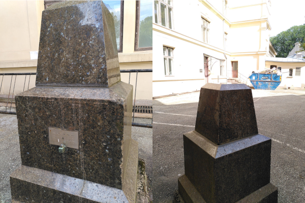
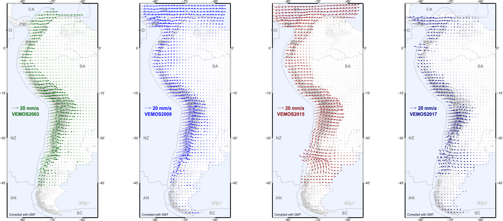
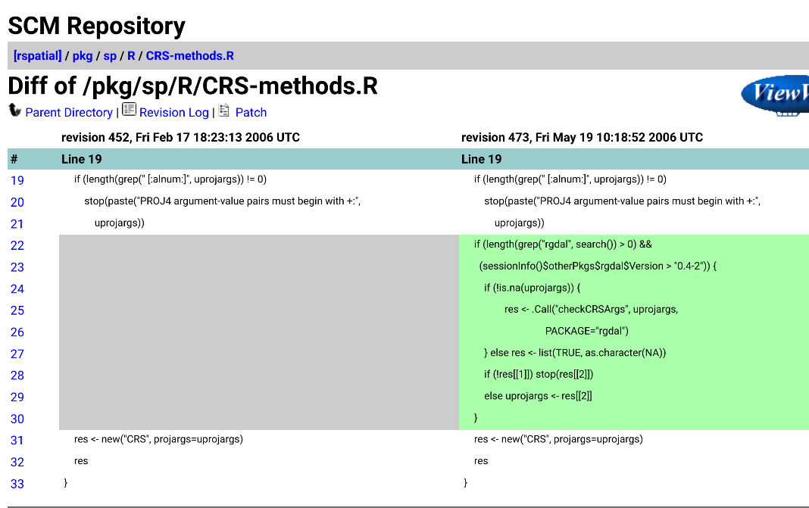

```{r setup, include=FALSE}
knitr::opts_chunk$set(echo = TRUE, paged.print=FALSE)
```

# Introduction

The usefulness of spatial data is linked to knowing its coordinate reference system. If the coordinate reference system is unknown, the information in the data set may not readily be integrated with other data using position. Further, metric information may not be readily used to measure distances between observations.

In this workshop, we will review the background to coordinate reference systems based on @sdsr (also to be found at https://r-spatial/book), and look somewhat more closely at datum transformation in the context of advances in the PR$\phi$J software implementation.

We will then go on to see how coordinate reference systems are handled, and datum transformations supported, in R packages and Python modules. The use of the S2 Geometry library will also be mentioned.

# What are coordinate reference systems and when do they matter?

Before we can try to understand geometries like points, lines,
polygons, coverage and grids, it is useful to review coordinate
systems so that we have an idea what exactly coordinates of a
point reflect.  For spatial data, the location of observations
are characterised by coordinates, and coordinates are defined in
a coordinate system.  Different coordinate systems can be used for
this, and the most important difference is whether coordinates are
defined over a 2-dimensional or 3-dimensional space referenced
to orthogonal axes (Cartesian coordinates), or using distance
and directions (polar coordinates, spherical and ellipsoidal
coordinates). Besides a location of observation, all observations
are associated with time of observation. 

For many quantities, the natural origin of values is zero. This
works for amounts, where differences between amounts result in
meaningful negative values. For locations and times, differences
have a natural zero interpretation: distance and duration.  Absolute
location (position) and time need a fixed origin, from which we
can meaningfully measure other absolute space-time points: we
call this **a datum**.
For space, a datum involves more than one dimension. The combination
of a datum and a measurement unit (scale) is a _reference system_.

## What are coordinate reference systems?

We will now elaborate how spatial locations can be expressed as
either ellipsoidal or Cartesian coordinates. 

### Basic concepts

In three dimensions, where Cartesian coordinates are expressed as
$(x,y,z)$, spherical coordinates are the three-dimensional equivalent
of polar coordinates and can be expressed as $(r,\lambda,\phi)$, where:

* $r$ is the radius of the sphere,
* $\lambda$ is the longitude, measured in the $(x,y)$ plane counter-clockwise from positive $x$, and
* $\phi$ is the latitude, the angle between the vector and the $(x,y)$ plane.

$\lambda$ typically varies between $-180^{\circ}$ and $180^{\circ}$
(or alternatively from $0^{\circ}$ to $360^{\circ}$), $\phi$ from
$-90^{\circ}$ to $90^{\circ}$.  When we are only interested in points
_on_ a sphere with given radius, we can drop $r$: $(\lambda,\phi)$
now suffice to identify any point.

### Surface or volume?

In addition to longitude and latitude we can add _altitude_ or
elevation to define points that are above or below the ellipsoid,
and obtain a three dimensional space again. When defining altitude,
we need to choose:

* where zero altitude is: on the ellipsoid, or relative to the surface approximating mean sea level (the geoid)?
* which direction is positive, and 
* which direction is "straight up": perpendicular to the ellipsoid surface,
or in the direction of gravity, perpendicular to the surface of the geoid?

All these choices may matter, depending on the application area
and required measurement accuracies.

### Ellipsoid of revolution

The most commonly used parametric model for the Earth is _an
ellipsoid of revolution_, an ellipsoid with two equal semi-axes
[@iliffe]. In effect, this is a flattened sphere (or spheroid):
the distance between the poles is (slightly: about 0.33%) smaller
than the distance between two opposite points on the equator. Under
this model, longitude is always measured along a circle, and latitude along an ellipse.

The shape of the Earth is not a perfect ellipsoid. As a consequence,
several ellipsoids with different shape parameters and bound to
the Earth in different ways are being used. Such ellipsoids are called
_datums_.

### Projected coordinates

Because paper maps and computer screens are much more abundant
and practical than globes, most of the time we look at spatial
data we see it _projected_: drawn on a flat, two-dimensional
surface. Computing the locations in a two-dimensional space means
that we work with _projected_ coordinates. Projecting ellipsoidal
coordinates means that shapes, directions, areas, or even all three,
are distorted [@iliffe].

### Bounded or unbounded?

Two-dimensional and three-dimensional Euclidean spaces ($R^2$ and
$R^3$) are unbounded: every line in this space has infinite length,
distances, areas or volumes are unbounded. In contrast, spaces
defined on a circle ($S^1$) or sphere ($S^2$) define a bounded set:
there may be infinitely many points but the length and area of the
circle and the radius, area and volume of a sphere are bound.

This may sound trivial, but leads to some interesting findings
when handling spatial data. A polygon on $R^2$ has unambiguously an
inside and an outside. On a sphere, $S^2$, any polygon divides
the sphere in two parts, and which of these two is to be considered
inside and which outside is ambiguous and needs to be defined
e.g. by the traversal direction.

### Definition of cordinate reference system

We follow @lott2015 when defining the following concepts (italics indicate literal quoting):

* a **coordinate system** is a _set of mathematical rules for specifying how coordinates are to be assigned to points_,
* a **datum** is a _parameter or set of parameters that define the position of the origin, the scale, and the orientation of a coordinate system_, 
* a **geodetic datum** is a _datum describing the relationship of a two- or three-dimensional coordinate system to the Earth_, and
* a **coordinate reference system** is a _coordinate system that is related to an object by a datum; for geodetic and vertical datums, the object will be the Earth._

The definitions above imply that coordinates in degrees longitude
and latitude only have a meaning, i.e. can only be interpreted
unambiguously as Earth coordinates, when the datum they are
associated with is given.

### Conversion and transformation

Note that for projected data, the data that _were_ projected
are associated with a reference ellipsoid (datum). Going from
one projection to another _without_ changing datum is called
_coordinate conversion_, and passes through the ellipsoidal
coordinates associated with the datum involved. This process is
lossless and invertible: the parameters and equations associated
with a _conversion_ are not empirical. Recomputing coordinates in a
new datum is called _coordinate transformation_, and is approximate:
because datums are a result of model fitting, transformations
between datums are models too that have been fit; the equations
involved are empirical, and multiple transformation paths, based
on different model fits and associated with different accuracies,
are possible.

Plate tectonics imply that within a global datum, fixed objects may
have coordinates that change over time, and that transformations
from one datum to another may be time-dependent. Earthquakes are a
cause of more local and sudden changes in coordinates. Local datums
may be fixed to tectonic plates (such as ETRS89), or may be dynamic.


## When do coordinate reference systems matter?

When a coordinate reference system is adequately defined, the coordinates can be placed on background maps, and integrated with other data sets, both with known coordinate reference systems. An adequate definition will further depend on the purposes for using the positional data, so that for higher precision it may also be necessary to specify the date of measurement, as tectonic plates move, although not fast.

### Hidden assuptions

Sometimes, assumptions are made in specification definitions. In the GeoPackage definition, https://gdal.org/drivers/vector/gpkg.html#coordinate-reference-systems, an undefined ellipsoidal (geographical) coordinate reference system in decimal degrees is assumed if no definition is given. Consequently, even not defining a coordinate reference system may have consequences, particularly if data sets are being shared with others in a more complex workflow.

## Unknown or arbitrary coordinate reference systems

It may also be desirable to specify a planar coordinate reference system as unknown, with no known metric or even axis direction. This might be needed for anonymizing data such as the location of protected species, or for confidentiality reasons. The same may occur when data are placed in a rectangle with unit longest sides for point pattern analysis and rotated and/or flipped; the metric here will be seen as arbitrary.

### Discovering legacy datums and projections

Sometimes it is the case that data sets stem from different time periods. Working back to the contemporary understandings of coordinate reference systems is hard, not only because in many jurisdictions these details have been considered graded military information. 

The [Grids & Datums column](https://www.asprs.org/asprs-publications/grids-and-datums) by Clifford Mugnier in *Photogrammetric Engineering & Remote Sensing* gives insight into some of the peculiarities of national mapping agencies - authority is typically national but may be subnational:

```{r}
load("GridsDatums.rda")
GridsDatums[grep("United States", GridsDatums$country),]
```

```{r}
GridsDatums[grep("Norway", GridsDatums$country),]
```

```{r echo=FALSE}

```


## How are coordinate reference systems defined?

Very few living people active in open source geospatial software
can remember the time before PROJ. PROJ [@evenden:90] started in the
1970s as a Fortran project, and was released in 1985 as a C library
for cartographic projections. It came with command line tools for
direct and inverse projections, and could be linked to software
to let it support (re)projection directly. Originally, datums were
considered implicit, and no datum transformations were allowed.

The two basic coordinate reference systems are geographical (GEOCRS) and projected (PROJCRS). In the original PROJ library, input for `proj` had to be in degrees, with output in the metric specified in the target PROJCRS. The `invproj` command inverted the projected points back to degrees from the specified PROJCRS.

In the early 2000s, PROJ was known as PROJ.4, after its never changing major version number. Amongst others motivated by the rise of GPS, the need for datum transformations increased and PROJ.4 was extended with rudimentary datum support, and a placeholder was introduced to indicate a target GEOCRS. Each specification needed not only an ellipse (or a datum implying an ellipse). Further, it was assumed that if the source and target CRS differed in datum, some method must be provided to transform to or from the chosen WGS84 hub, typically a grid or three or seven coefficient transformation. 

While most national mapping agencies defined their own standard geographical and projected CRS, supranational bodies, such as military alliances and colonial administrations often imposed some regularity to facilitate operations across national boundaries. This also led to the creation of the European Petroleum Survey Group (EPSG), because maritime jurisdiction was not orderly, and mattered when countries sharing the same coastal shelf tried to assign conflicting exploration concessions. Experts from oil companies accumulated vast experience, which fed through to the International Standards Organization (ISO, especially TC 211) and the Open Geospatial Consortium (OGC).

Defining the CRS became necessary when integrating other data with a different CRS, and for displaying on a web map background. Many legacy file formats, such as the ESRI Shapefile format, did not mandate the inclusion of the CRS of positional data. Most open source software then used PROJ.4 strings as a flexible representation, but as internationally accepted standards have been reached, in particular ISO 19111 @iso19111, and improved over time by iteration, it is really necessary to change to a modern text representation, known as WKT2 (2019).

The EPSG database https://epsg.org/home.html is updated regularly and contains not only CRS definitions, but also authoritative tables specifying transformation pathways between CRS. A major change occurred with version 10 of the data model, introducing datum ensembles, and beginning to identify dynamic datums.

```{r set-options-cdn, echo=FALSE, results='hide'}
td <- tempfile()
dir.create(td)
Sys.setenv("PROJ_USER_WRITABLE_DIRECTORY"=td)
#Sys.setenv("PROJ_NETWORK"="ON")
Sys.setenv("_SP_EVOLUTION_STATUS_"=0)
```

## How are coordinate reference systems represented?

PROJ.4 used a simple `+key=value` representation for PROJCRS, extended as noted to GEOGCRS. This had to be backed by text files (CSV files) distributed with the software, and optionally supplemented by a small number of transformation grid files (such as `conus`) in legacy formats. The `+key=value` representation is used internally in PR$\phi$J transformation pipelines, but is no longer encouraged for CRS representation elsewhere.

Coordinate reference systems following ISO 19111 should be represented as Well-Known Text 2 (2019) (WKT2:2019) objects. One consequence is that file formats not supporting the WKT2:2019 representation may degrade the CRS on writing (or reading). One such legacy file format is the `ESRI Shapefile`, which writes a WKT1 in ESRI dialect into the `.prj` file.

As an example, let us use the simple `"OGD:CRS84"` longitude-latitude WGS84 WKT2:2019 representation used by among others GeoJSON files https://geojson.org/ https://www.rfc-editor.org/rfc/rfc7946#page-12 using the PR$\phi$J program `projinfo`:

```{bash}
projinfo OGC:CRS84
```

This information is collated from SQL queries executed on the `proj.db` SQLite database installed with PR$\phi$J (since version 6) and found on the searchpath, the first element of which is user-writable (since version 7):

```{bash}
projinfo --searchpaths
```
This database may be examined using standard tools:

```{r}
library(RSQLite)
db <- dbConnect(SQLite(), dbname=file.path("/usr/local/share/proj/proj.db"))
dbListTables(db)
```

```{r}
dbListFields(db, "geodetic_crs")
```
Since we know that the name of this GEOGCRS is `"WGS 84 (CRS84)"`, we can retrieve that entry from the `geodetic_crs` table:

```{r}
dbGetQuery(db, 'SELECT * FROM geodetic_crs WHERE name = "WGS 84 (CRS84)"')
```
and having located the datum code, query that from the `geodetic_datum` table:

```{r}
dbGetQuery(db, 'SELECT * FROM geodetic_datum WHERE code = 6326')
```

```{r}
dbDisconnect(db)
```

The remainder done by PR$\phi$J is to marshall the details of the CRS retrieved from the database in the requested output format, typically now WKT2:2019.

Sometimes the GDAL rendering may differ from that returned directly by PR$\phi$J (see also https://github.com/OSGeo/gdal/issues/2035) from the same `proj.db` database:

```{bash}
gdalsrsinfo OGC:CRS84
```


# Datum transformation

Because so much open source (and other) software uses the PROJ library and framework, many are affected when PROJ upgrades. Until very recently, PROJ has been seen as very reliable, and the changes taking place now are intended to confirm and reinforce this reliability. Before PROJ 5 (PROJ 6 was released in 2019, PROJ 7 was released in March 2020), the `+datum=` tag was used, perhaps with `+towgs84=` with three or seven coefficients, and possibly `+nadgrids=` where datum transformation grids were available. However, transformations from one projection to another first inversed to longitude-latitude in WGS84, then projected on to the target projection.

> Fast-forward 35 years and PROJ.4 is everywhere: It provides coordinate handling for almost every geospatial program, open or closed source. Today, we see a drastical  increase  in  the  need  for  high  accuracy  GNSS  coordinate  handling, especially in the agricultural and construction engineering sectors. This need for geodetic-accuracy transformations  is  not  satisfied  by "classic  PROJ.4". But with  the  ubiquity  of  PROJ.4,  we  can provide these transformations "everywhere", just by implementing them as part of PROJ.4 [@evers+knudsen17].


## Transformation hubs

Along with PROJ.4 came a set of cvs files with known (registered)
projections, from which the best known is the European Petroleum Survey Group (EPSG) registry.
National mapping agencies would provide (and update over time)
their best guesses of `+towgs84=` parameters for national coordinate
reference systems, and distribute it through the EPSG registry,
which was part of PROJ distributions.
For some transformations, _datum grids_ were available and
distributed as part of PROJ.4: such grids are raster maps that provide
for every location pre-computed values for the shift in longitude
and latitude, or elevation, for a particular datum transformation.

In PROJ.4, every coordinate transformation had to go through a
conversion to and from WGS84; even reprojecting data associated with
a datum different from WGS84 had to go through a transformation to
and from WGS84. The associated errors were acceptable
for mapping purposes for not too small areas, but applications that
need high accuracy transformations, e.g. precision agriculture,
planning flights of UAV's, or object tracking are often more
demanding in terms of accuracy.

Geodetic modules and pipelines were introduced in PROJ 5 [@knudsen+evers17; @evers+knudsen17]. Changes in the legacy PROJ representation and WGS84 transformation hub have been coordinated through the [GDAL barn raising](https://gdalbarn.com/) initiative. Crucially WGS84 often ceases to be the pivot for moving between datums. See also [PROJ migration notes](https://proj.org/development/migration.html).

There are very useful postings on the PROJ mailing list from Martin Desruisseaux, first [proposing clarifications](https://lists.osgeo.org/pipermail/proj/2019-July/008748.html) and a [follow-up](https://lists.osgeo.org/pipermail/proj/2019-August/008750.html) including a summary:

> * "Early binding" ≈ hub transformation technique.

> * "Late binding" ≈ hub transformation technique NOT used, replaced by
a more complex technique consisting in searching parameters in the
EPSG database after the transformation context (source, target,
epoch, area of interest) is known.

> * The problem of hub transformation technique is independent of WGS84.
It is caused by the fact that transformations to/from the hub are
approximate. Any other hub we could invent in replacement of WGS84
will have the same problem, unless we can invent a hub for which
transformations are exact (I think that if such hub existed, we
would have already heard about it).

> The solution proposed by ISO 19111 (in my understanding) is:

> * Forget about hub (WGS84 or other), unless the simplicity of
early-binding is considered more important than accuracy.

In using a transformation hub, PROJ had worked adequately when the errors introduced by transforming first to WGS84 and then from WGS84 to the target coordinate reference system, but with years passing from 1984, the world has undergone sufficient tectonic shifts for errors to increase. 

In addition, the need for precision has risen in agriculture and engineering. 
So PROJ, as it was, risked ceasing to be fit for purpose as a fundamental component of the geospatial open source software stack.

Following major changes in successive iterations of the international standards for coordinate reference systems [@iso19111], PROJ is changing from preferring "early-binding" transformations, pivoting through a known transformation hub in going from input to target coordinate reference systems, to "late-binding" transformations. 

This means that the user may be offered alternative paths - _pipelines_ - from input to target coordinate reference systems, some of which may go directly, and more will use higher precision transformation grids, enlarging the existing practice of using North American Datum (NAD) grids. 

In other cases, three or seven coefficient transformations may be offered, but the default fallback, where little is known about the input or target specification, may be less satisfactory than PROJ has previously offered.


## Transformation pipelines

Before PROJ 5, each CRS declared a transformation path to WGS84, so the WGS84 hub was viable if inaccurate. Transformation pipelines were introduced in PROJ 5, showing the steps taken from source to target, possibly including a hub. From PROJ 6, the SQLite database contained tables of names and locations of grids needed, and tables of coefficient values, needed to collate a transformation pipeline.

In addition, the current iteration of the standard makes it more important to declare the epoch of interest of coordinates (when the position was recorded and how) and the region of interest. A transformation pathway may have an undefined epoch and a global span, but cannot achieve optimal precision everywhere. 

By bounding the region of interest say within a tectonic plate, and the epoch to a given five-year period, very high precision transformations may be possible. These choices have not so far been required explicitly, but for example matching against the `"area"` table in the database may reduce the number of transformation pathways offered dramatically.

The SIRGAS velocity model http://www.sirgas.org/en/velocity-model/ gives another picture of why the changes in PROJ matter:

```{r echo=FALSE}

```


### Transformation pipelines example: Chicago Board of Trade Building

Assume that we take the Chicago Board of Trade Building as a reference point, and assume that the point location given by Wikipedia https://en.wikipedia.org/wiki/Chicago_Board_of_Trade_Building, 41.878056, -87.632222, is adequately accurate. Note that the axis order of the coordinates is given as latitude-longitude. Say we wish to compare this modern point observation (assumed to be in NAD83(HARN) - (High Accuracy Reference Network) with an older map in NAD27. These are the full WKT2:2019 representations of these GEOGCRS:

```{bash}
projinfo "EPSG:4152"
```

```{bash}
projinfo "ESRI:104000"
```

Note that both the datums and the ellipsoids differ, so that some change in the coordinates would be expected anyway. We can interrogate the database for reasonable choices, here narrowing down the search over alternatives by giving a rough bounding box:

```{r}
Sys.unsetenv("PROJ_NETWORK")
```

```{bash}
projinfo -o PROJ --spatial-test intersects --bbox -87.7,41.87,-87.6,41.9 -s "EPSG:4152" -t "ESRI:104000"
```

We see three outcomes, two for states intersecting the given bounding box with 0.2m accuracy, but which cannot be instantiated because transformation grids are missing. The final outcome can be instantiated but only has ballpark accuracy. 

In general in North America transformation grids are needed, while in many other jurisdictions, three or seven parameter Helmert or other transformations with varying accuracy may be found in the database.

Let us check the status of the `PROJ_NETWORK` environment variable:

```{r}
Sys.getenv("PROJ_NETWORK")
```
```{bash}
echo $PROJ_NETWORK
```
The fifth digit after the decimal point is here about 1m, so simply using the different ellipsoid definitions shifts the point a couple of metres on each axis:

```{bash}
echo 41.878056 -87.632222 | cs2cs -f %.5f --bbox -88,41,-87,42 "EPSG:4152" "ESRI:104000"
```

However, grids were listed as missing; how can we now get the grids?

## Transformation grids

The most accurate direct transformation pipelines may need transformation grids rather than 3 or 7 parameter transformation models applied equally over the area of interest. While the legacy `proj-datumgrid` zipfile never exceeded 6.3 MiB, the current `proj-data` zipfile is 562.5 MiB (https://download.osgeo.org/proj/). Since it is unlikely that users need transformation grids for all continents, one can download by continent (Oceania, North America, Europe), or for global transformations, but these are still all large. The volume of transformation grids released under permissive licenses and hosted by the CDN will continue to increase rapidly.

Instead of installing lots of unneeded grids, which may become stale, use can be made of an on-demand content download network https://cdn.proj.org from within PROJ, using CURL for download and TIFF as the unified grid format (Cloud Optimized GeoTiff). On-demand use creates a user-writeable `cache.db` SQLite database of grid chunks, which may be used across applications looking at the same `PROJ_LIB` directory:

```{r}
list.files(td)
```

```{r}
Sys.setenv("PROJ_NETWORK"="ON")
```

```{bash}
echo $PROJ_NETWORK
```

```{bash}
echo 41.878056 -87.632222 | cs2cs -f %.5f --bbox -88,41,-87,42 "EPSG:4152" "ESRI:104000"
```

Now the shifts are about one metre more on each axis. Unsetting the network variable prepares the workspace for later choices.

```{r}
Sys.unsetenv("PROJ_NETWORK")
```

The user-writable directory now contains a `cache.db` SQLite database of downloaded grid chunks:

```{r}
list.files(td)
```

The tables in the database can be listed:

```{r}
db <- dbConnect(SQLite(), dbname=file.path(td, "cache.db"))
dbListTables(db)
```
and the catalogue in the `"chunks"` table shown:

```{r}
dbReadTable(db, "chunks")
```

```{r}
dbDisconnect(db)
```

The first CDN access downloads required chunks as Tiff files; on subsequent use, the chunks may be checked for staleness. 

If we download `conus.tif`, we can display the latitude and longitude transformation offset shifts that it provides:

```{r}
rnaturalearth::countries110 |> 
    sf::st_as_sf() |>
    subset(admin == "United States of America") |>
    sf::st_geometry() -> us
hook <- function() {
        plot(us, col = NA, add = TRUE)
}
r <- stars::read_stars("us_noaa_conus.tif")
plot(r[,,,1:2], axes = TRUE, hook = hook, key.pos = 4, col=cm.colors)
```


# CRS in R packages


## Representing CRS in R packages

### CRS in R before PROJ 

The **mapproj** package provided coordinate reference system and projection support for the **maps** package. From `mapproj/src/map.h` (originally from Plan 9 https://plan9.io/sources/plan9/sys/src/cmd/map/map.h), line 20, we can see that the eccentricity of the Earth is defined as `0.08227185422`, corrresponding to the Clark 1866 ellipsoid [@iliffe]:


```{r, echo = TRUE}
ellps <- sf::sf_proj_info("ellps")
(clrk66 <- unlist(ellps[ellps$name=="clrk66",]))
```

With a very few exceptions, projections included in `mapproj::mapproject()` use the Clarke 1866 ellipsoid as defined in metres in the ellipse used in NAD27 (not as Clarke's original British feet), with the remainder using a sphere with the Clarke 1866 major axis radius. The function returns coordinates for visualization in an unknown metric; no inverse projections are available.

```{r, echo = TRUE}
eval(parse(text=clrk66["major"]))
eval(parse(text=clrk66["ell"]))
print(sqrt((a^2-b^2)/a^2), digits=10)
```

This is the WKT2:2019 representation of the (minimalist) PROJ.4 string:

```{bash}
projinfo "+proj=longlat +ellps=clrk66 +type=crs"
```

### Antecedents for PROJ use in R packages

As @pebesma+bivand:05 present the nascent **sp** package (the role of the Vienna DCS 2003 conference is also depicted by @bivand:21, https://www.r-project.org/conferences/DSC-2003//Proceedings/index.html, https://www.r-project.org/conferences/DSC-2003//Proceedings/Bivand.txt), the choice of PROJ.4 as the `"projargs"` slot of `"CRS"` objects *just happened*. From 1998 to 2005, quite a lot was occurring, including contact with GRASS GIS, which had started interfacing PROJ.4, Tim Keitt's **GDAL** package, Nicholas Lewin Koh's contribution of a shapelib interface to **maptools**, and so on. 

The **rgdal** package integrated **GDAL** and work by Barry Rowlingson on interfacing the OGR library (**Rmap**) and PROJ.4 (**spproj**); both of these were merged with **rgdal**. It seemed natural to use PROJ.4 like everyone else we were aware of at that time. Recall that GPS precision restrictions for civilian use were only removed May 1, 2000, so CRS could really only try to record what the publishers of paper maps declared. Hand surveying was costly and time-consuming, digitizing positional data likewise.

So **sp** used PROJ.4 strings, and from 2006, used PROJ.4 to check whether the string given by the user was valid:

```{r echo=FALSE}

```

When reading raster or vector data objects, the CRS was read from the data source. Often ESRI Shapefiles omitted `*.prj` files, and this was represented as a missing CRS, a character `NA` in place of a valid PROJ.4 string. 

We've established that we should have preferred WKT over PROJ strings at least a decade ago: https://lists.osgeo.org/pipermail/gdal-dev/2012-November/034558.html (read the last paragraph), and possibly even earlier.


### The **sf** and **stars** packages

```{r}
sf::st_crs("OGC:CRS84")
```

### Working in S2 or R2

### The **terra** package

```{r}
v <- terra::vect()
terra::crs(v) <- "OGC:CRS84"
cat(terra::crs(v), "\n")
```

### The **sp** and **raster** packages


### Handling `"CRS"` objects from the **sp** package when **rgdal** has retired


## Discovering transformation pipelines in **sf**

## Transforming spatial objects in **sf** and **terra**

## Using the CDN in **sf** and **terra**


# CRS in Python modules

## Representing CRS in Python modules

### Working in S2 or R2

## Discovering transformation pipelines in **pyproj**

## Transforming spatial objects in **pyproj**

## Using the CDN in **pyproj**


### References

